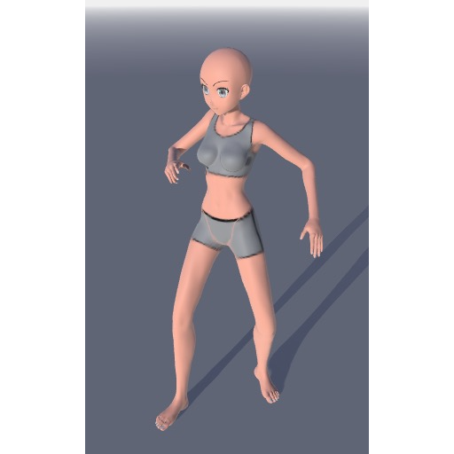
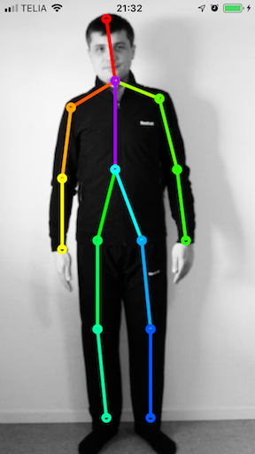

# Human Pose estimation
This framework estimates the human pose on an image. The parts of the human body used in this project are shown in the following image:


More information regarding the human pose model might be found here: [MPI-pose](https://pose.mpi-inf.mpg.de/)

| For the demo purposes I took images with myself)                | The result human pose estimation drawn over the original image  |
| :----------------------------------------------------------------------------------------------------------------------------: |:---------------------------------------------------------------------------:|
|  |  |

## Preparing the model
To start using the framework a Core ML model is needed to be created. This model is based on one from the [openpose project](https://github.com/CMU-Perceptual-Computing-Lab/openpose). To create a model do the following:
1) Install Python and [CoreML tools](https://apple.github.io/coremltools/index.html)
2) Run models/getModels.sh from [Open Pose](https://github.com/CMU-Perceptual-Computing-Lab/openpose) to get the original openpose models
3) Copy models/pose/mpi/pose_deploy_linevec_faster_4_stages.prototxt to models/pose/mpi/pose_deploy_linevec_faster_4_stages_fixed_size.prototxt
4) Change the following in the file pose_deploy_linevec_faster_4_stages_fixed_size.prototxt:
```
input_dim: 1 # This value will be defined at runtime ->  input_dim: 512
input_dim: 1 # This value will be defined at runtime ->  input_dim: 512
```
5) Create a link to the models directory. Let's assume that the pose framework project and openpose project are in the home directory, then command to create a link would be the following:

`ln -s ~/openpose/models ~/models`

6) Go to the ~/pose/pose/CoreMLModels and run the following command:

`python convertModel.py`

The above mentioned script contains hardcoded values to the file pose_deploy_linevec_faster_4_stages_fixed_size.prototxt and model file pose_iter_160000.caffemodel.
They could be changed to some other model but please do not forget to change the .prototxt file to have a fixed size of the input image:
input_dim: XXX  - corresponds to the with of the NN input.
input_dim: XXX  - corresponds to the height of the NN input.
Also **do not forget to change the model configuration PoseModelConfigurationMPI15.inputSize to a specified input value** and use this configuration instead of an existing one in the framework which sets 512x512 as an input size.

Any values will work but the best results could be achieved if an aspect ratio matches the one that an original image has. Also, it should be taken into account that bigger values will affect the performance significantly which is shown in the [Performance](#Performance).

## Neural network output details
The output of the MPI15 model is a group of matrices whith dimensions `(input_image_width / 8, input_image_height / 8)`. Each element in the matrix has float type. Mapping between matrix index in the output and the body part:
```
POSE_MPI_BODY_PARTS {
{0,  "Head"},
{1,  "Neck"},
{2,  "RShoulder"},
{3,  "RElbow"},
{4,  "RWrist"},
{5,  "LShoulder"},
{6,  "LElbow"},
{7,  "LWrist"},
{8,  "RHip"},
{9,  "RKnee"},
{10, "RAnkle"},
{11, "LHip"},
{12, "LKnee"},
{13, "LAnkle"},
{14, "Chest"},
{15, "Background"}
};
```

### Heatmaps and PAFs
There are two types of output matrices in the MPI15 model. The ones that represent heatmaps and the others that represent PAFs. Each heat matrix corresponds to one joint part which is 15 in total. The PAF matrices represent body connections. For each body connection, there is X and Y matrix which is 28 in total (14 + 14). The total amount of matrices including a background one is 44.

## Demo project
The repository also contains a demo project 'poseDemo' that demonstrates usage of the framework.

| Sample                                                                             | Images                                                                                              |
| :---------------------------------------------------------------: |:---------------------------------------------------------------------------:|
| Human pose result:                                                          | Heatmaps combined into one image. Each joint has its own color:|
|  |                     |
| PAFs combined into one image:                                      |   All heatmap candidates. Each candidate has its own confidence which defines its opacity on the image: |
|            |  |
| Closer look at heatmap candidates corresponding a head:| Closer look at heatmap candidates corresponding to a neck:|
|  |  |
|  PAF matrix which corresponds to a head neck connection candidate. The head, neck heatmap joints are shown also on the image: | PAF matrix which corresponds to a LShoulder, LElbow connection candidate. The LShoulder-LElbow heatmap joints are shown also on the image:|
|  | |

## Performance

### Time to process one frame (1-2 persons in the view)

|   NN input size    | iPhone XR (ms)   | iPhone 8 (ms) | iPhone 5S (ms) |
|:-------------------:|:-------------------:|:-----------------:|:------------------:|
|      CoreML       |
|      512 x 512       |          190            |      3670          |        20801        |
|      256 x 256       |          70            |       1039        |         7162         |
|      **Post-processing**      |
|      512 x 512       |          19          |        67        |        100        |
|      256 x 256       |          5           |       35         |                  |
|      **Total**       |
|      512 x 512       |          219       |       3737     |        20901        |
|      256 x 256       |           75          |     1074     |           7200       |

All numbers shown above could vary for each particular run.

### The result pose depending on the NN input size (the smaller and faster the less accurate result is)
|      512 x 512       |    256 x 256       |
| :----------------------------------------------------------------------------------------: | :--------------------------------------------------------------------------------------------------------:|
|            |                 |

## Applications

### Healthcare

1) Detecting anomalies in the human spine on still images:
    
2) Health and fitness guide.


### Home security and automation (not related to mobile phones)

1) Detecting if people at home and check if all the equipment is switched off (iron/owen).
2) Locating people inside the living area and do automation (turn on lights/music/tv)

## Improvements
1) NMS optimization. A parallel GPU implementation using METAL API.
2) Use a different approximation for joints connection that is closer to real-life skeleton bones. Bones are not straight.
3) Implement more robust filtering for the output pose to get rid of artifacts.
4) Implement a pose estimation on a video stream

## In-Depth information
1) http://posefs1.perception.cs.cmu.edu/Users/ZheCao/Multi-person%20pose%20estimation-CMU.pdf
2) https://www.ri.cmu.edu/wp-content/uploads/2017/04/thesis.pdf
3) https://pose.mpi-inf.mpg.de/

## Some fun
|   |   |
| :----------------------------------------------------------------------------------: | :------------------------------------------------------------------------------------:|
|The image was taken from [Magic Poser](https://magicposer.com) <br/> |  |
|  |  |
